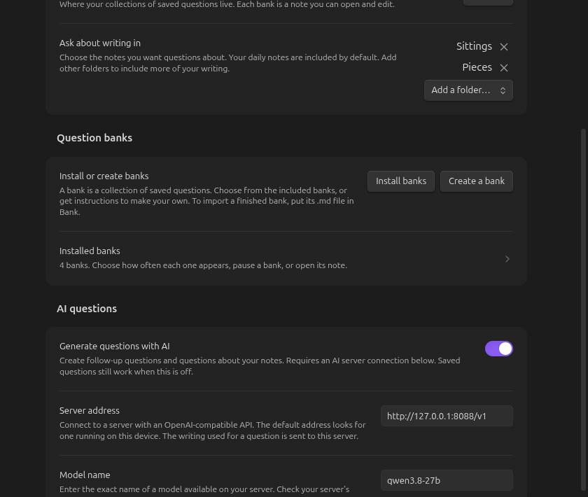

# keep-writing: the guide

Everything past the [README](../README.md).

## Where questions come from

Two jars. Seven draws in ten come from the first.

| Jar | What's in it | How it's asked |
|---|---|---|
| **The bank** | Questions other people wrote — every list item with a block id in a note in your bank folder whose frontmatter says `kind: bank` | As written |
| **Your writing** | Every block with an id, in the folders you name in settings | The model builds a question about it |

The bundled banks hold 3,576 questions across 22 answer registers. Choose which of these five notes to install:

| Note | Questions | What it asks for |
|---|---|---|
| `ordinary-life.md` | 100 | Familiar places, small encounters, objects, meals, and things you notice; no project needed |
| `autobiographical.md` | 1,685 | A life you already lived — one occasion, a thing that happened again and again, a stretch of years, a plain fact, what you take yourself to be, what you mean to do, what you hold worth it, why you think it happened, what you hold true, how it felt, what a change left behind |
| `autoethnographic.md` | 1,023 | The same life read as a culture, and an account of the telling |
| `learning.md` | 342 | What you understand, what your hands can do, and what you would have to go and find out |
| `invention.md` | 426 | Not retrieval at all: a prompt, whose answer does not exist until you write it |

Personal questions pass the Bank test: a stranger cannot supply your actual answer. A brief answer is welcome when its particulars belong to you. The ordinary-life bank was reviewed against that same test. Invention prompts use a separate rubric for distinctive focus, depth, openness, freedom of form, and clear wording.

They arrive as notes, not as data inside the plugin, and that is load-bearing. A question is answered when a block links to it, so a question with no address in your vault could never be retired. Once written they are yours — edit them, delete them, add your own.

A bank note is ordinary Markdown: one question per list item, a `#register/…` tag saying what kind of answer it calls for, and a block id so the question can be cited.

```markdown
---
kind: bank
---

- what do you get complimented on the most? #register/value ^b17850831
- what did you make this week? #register/episode ^b17850832
```

A question is *answered* when any block in the vault carries an `answers` link to it. Answered questions leave the jar, as do ones already asked in the note you are writing in.

## Choose, import, or create a bank

Open **Settings → keep-writing → Question banks**.



- **Install banks** lists the included banks with descriptions and question counts. Select the ones you want, then choose **Install selected**. Existing notes are never overwritten.
- **Add new questions** brings a later version's questions into the banks you already installed. It shows how many each bank would gain and adds nothing until you agree. New questions go into the section of their register. Nothing you wrote or changed is edited, and a question you deleted does not come back. The first time Obsidian loads a version that has new questions, it offers this once by itself; the command **Add new questions to installed banks** is there any time after.
- To import a bank from elsewhere, put its `.md` file in the **Question bank folder** (default `Bank`). It needs `kind: bank` in its frontmatter and the question syntax shown above. It appears under **Installed banks** after Obsidian indexes the note. Subfolders work too.
- **Create a bank** lets you name a subject and **Copy instructions** for your AI assistant or coding agent. The instructions include the file location, syntax, stable IDs, and both rubrics. **Create and open note** makes an empty bank containing those instructions. Ask your agent to replace that scaffold with its reviewed questions. Reopen the dialog to get the instructions again.

A ready-to-import personal bank looks like this:

```markdown
---
kind: bank
title: Garden
---

- what have you grown from something someone gave you? #register/episode ^garden-001
- which tool do you always reach for first? #register/artifact ^garden-002
```

Use a different filename and ID prefix for each bank. Keep IDs stable after you start answering: saved answers link to those IDs. An ordinary Markdown note without `kind: bank` is not a question bank.

## Choose how often each bank appears

Open **Question banks → Installed banks** to see the individual controls. The main settings page shows only the bank count until you open this page.

Each installed bank has a frequency from 0 to 100. A bank set to 20 appears twice as often as one set to 10, independent of bank size. Setting 0 pauses a bank without deleting its note. Within the chosen bank, each available question has the same chance.

The defaults give ordinary life a little more room:

| Bank | Default frequency |
|---|---|
| Ordinary life | 30 |
| Autobiographical | 25 |
| Autoethnographic | 20 |
| Learning | 15 |
| Invention | 10 |
| Each custom bank | 10 |

With all five included banks available, these numbers are also percentages of saved questions. If you install fewer banks, pause one, or answer all its questions, the remaining banks share the draws. The percentages in settings assume all installed banks have unanswered questions. **Restore default frequencies** restores this mix.

**Use saved questions (%)** separately controls saved questions versus questions about your own writing, with a default of 70%. If every bank is paused or exhausted, draws can still use your writing. An automatic opening question needs an available bank question.

## Spending a day on one thing

Put `about: "[[some note]]"` in a daily note's frontmatter and the bank closes: only that note's paragraphs are drawn.

## Picking up tomorrow

Tag one bank question `#role/bookmark` — "where should we pick up?" is the one this vault uses — and keep it at the end of your daily note template. Answer it, mark it done, and the answer's address is written as `next`:

```yaml
---
next: "[[Sittings/2026-09-16#^a4f201]]"
---
```

On `me.md`, or on the note your day was `about`. The next day's draw offers that paragraph first, reads it as something you chose rather than something it found, and puts what you wrote under the question. It stops offering it once you answer it, or the next time you leave a bookmark.

## The three model jobs

One call each, JSON out, one retry, then it gives up quietly. Every call runs at temperature 0 except the Follow-up, which is sampled so that marking again finds other questions.

- **Follow-up** — reads the question and your whole answer, offers up to three next questions. Candidates that hand your answer back, re-ask what you just answered, or refer to the conversation are dropped in code before you see them.
- **Revisit** — for a paragraph you pointed at. Reads it with one line of framing (`in 2021, in "Koramangala"`) and asks about it.
- **Invitation** — for a paragraph the draw found. Reads it with *no* framing, finds the concern under it, and asks something you can answer from today.

Given the same list about georeferencing a map in QGIS, the Revisit asked *"what specific data layer did you align the PNG against?"* and the Invitation asked *"what does it cost to make a thing fit the map it was never drawn for?"*


The model abstaining is a legal answer and is never worked around. Calls are logged to the developer console under `[keep-writing]` — the job, how long it took and how it ended, never the request or your key.

Settings → **What the AI looks for** holds two boxes, one per composer: **When you ask about a paragraph** steers the Revisit, and **When a paragraph is drawn** steers the Invitation. Each box's text, up to 100 words, is added to the end of the AI's instructions. Edit it to change how the model asks: it is the interviewer's technique as text you control, not a string in the source. Clear a box to go back to the default.

## Reading your vault in graph view

Every answer is linked, so after a few months the graph is a picture of the interview. One thing spoils it out of the box, and one filter fixes it.

**Filter the bank out.** Seven draws in ten come from your question bank, and bank questions live in a small group of notes, so many links converge on those notes. In graph view's filter box:

```
-path:Bank
```

What is left is the part worth looking at: each day's writing tied to the older paragraphs that provoked it. A piece you keep returning to grows visible edges, because every answer's `answers` property links to what provoked it. The biggest node is the writing that keeps paying out.

One thing the graph cannot show: follow-up chains. A follow-up cites the answer it came from in the same note, and Obsidian draws no link from a note to itself.

## Grow a piece out of a day

A daily note holds threads: a question you drew, and the follow-ups that came from answering it. A new draw is a new thread. When one of them is turning into writing, run **Graduate threads to pieces** in that note.

1. Tick the threads to graduate. Each becomes its own piece.
2. Give each piece a title. With the model on, three lines beside the field say what you wrote about, so you have something to name it by. They are not saved.
3. Leave **Suggest headings** off, and each question becomes its section's heading. Tick it to get a suggested heading per section, which you can keep, edit, or put back to the question.

Your paragraphs move as you wrote them, block ids and all, into the folder you chose. Every link to them, in any note, is pointed at their new place. The daily note keeps the rest of the day and lists the pieces under `graduated`.

A graduated piece has no `status`, so it is drawn as the piece you are writing, and questions about it name it by its title.

## What it will not do

The plugin never writes a sentence into your notes. Its entire write surface is three things:

1. **Frontmatter properties** — via Obsidian's own `processFrontMatter`.
2. **A block id** appended to a paragraph you already wrote (` ^a1b2c3`). No existing character changes.
3. **A `> [!ask]` callout**, at the end of the `## Asked` section.

There is no code path that inserts, edits or rewords prose. The body of a note is yours. Nothing is written without you picking it first, and Escape always means no.


## Ask for follow-ups again

Follow-ups live in the chooser that shows them. Press Escape and they are gone. To get new ones, put the cursor back in the answer and run **Mark this answer done, and follow up** again. The link is already there, so nothing is written twice, and the model composes fresh questions.

To take back a mark, delete the entry from the note's `answers` property. The source then comes back into the draw.

## Draw settings

**Use saved questions (%)** ranges from 0 (questions about your writing) to 100 (saved questions), with a default of 70.
When one jar is empty, draws use the other. A target still restricts draws to that note's paragraphs.
A draw reads Obsidian's own index of links and block ids, then reads only the notes it chose. Editing ordinary writing does not trigger a vault scan. Changes to bank notes refresh the bank list in settings.

## API key storage

API keys use Obsidian secret storage on the current device and are excluded from plugin `data.json`.
An existing plaintext key migrates on startup. The old value is removed only after secret storage succeeds.
An existing stored secret takes precedence. Old backups can still contain the previous plaintext key.
Remote endpoints still receive the text sent for composing questions; secret storage does not change that behavior.
